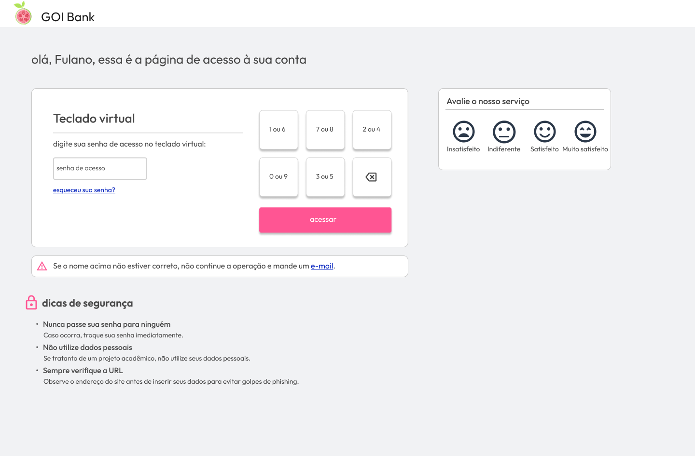
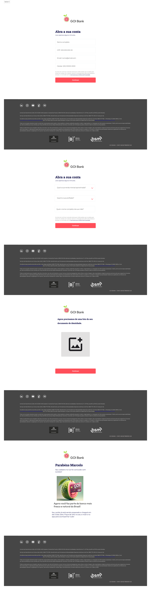
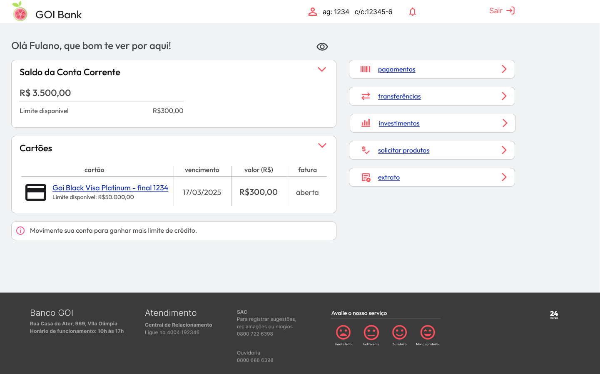
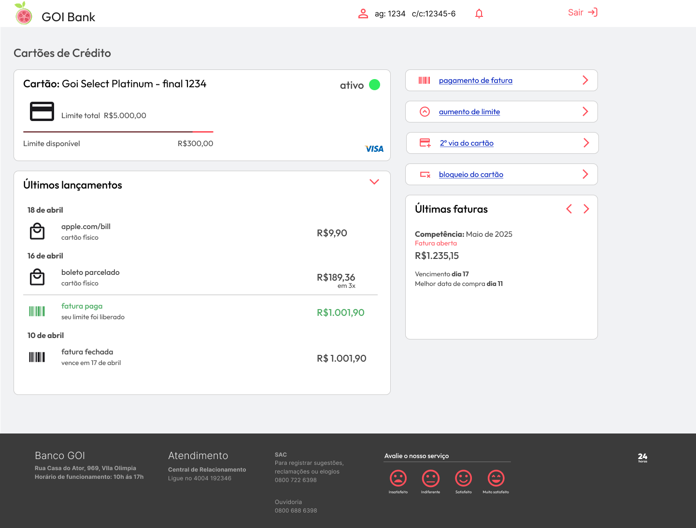
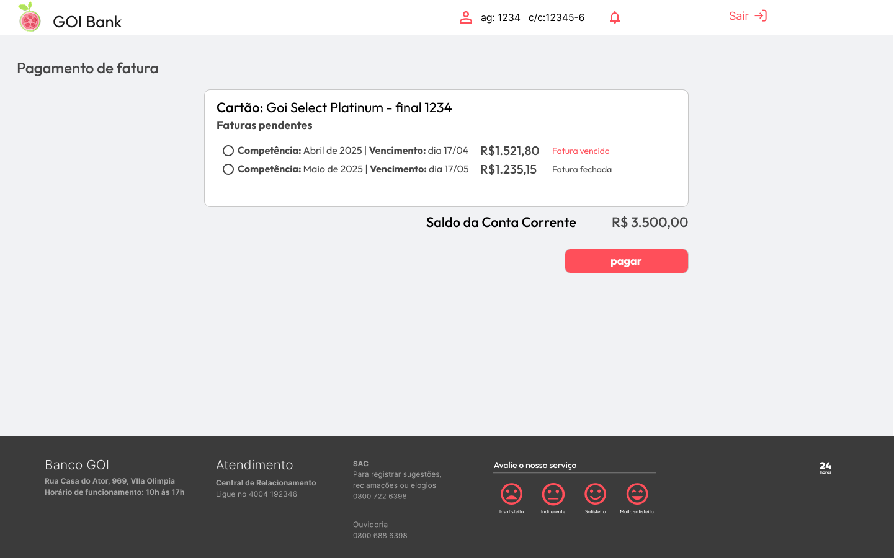

# Banco GOI
Este projeto representa a estrutura e funcionamento do Banco GOI, incluindo serviços financeiros e produtos bancários. Além disso, descrevemos a organização do time (Squad) responsável pelo desenvolvimento.

### O Banco GOI possui as seguinte funcionalidades:

📂 Conta Corrente Serviços

📥 Depositar

🔄 Transferir

💳 Cheque Especial

🏦 Cartão de Crédito

📈 CDBs

### O time de desenvolvimento está dividido em três áreas principais:

- Backend ⚙️ (Marcelo Afonso, Italo Silva)

- Frontend 🎨 (Maycon Daynor, Gustavo)

- Banco de Dados 🗄️ (Marcelo Afonso, Italo Silva)

- Infraestrutura 🛠️ (Marcelo Afonso)

Cada área tem a responsabilidade de desenvolver e manter suas respectivas partes do sistema.

### Tecnologias Utilizadas:

- Backend: Java 

- Frontend: Html, CSS, JavaScript

- Banco de Dados: MySQL

- Cloud: AWS RDS MySQL 

## Configurações Iniciais
1. Baixe as depêndencias no Maven
2. Configure a JDK 17 ou 21
3. Acrescente a pasta resources dentro de main (ao lado de Java) com as credenciais de conexão ao banco:
   ##### db.url=jdbc:mysql://goi-database.cjsxgdipkurd.us-east-1.rds.amazonaws.com:3306/goi-database
   ##### db.user=admin
   ##### db.password=SENAC2005$
5. Acesse via localhost:8080

### Credenciais
#### Usuário A
- CPF: 12345678901
- Senha: 123456

#### Usuário B
- CPF: 98765432196
- Senha: 124578

## Prototipagem

Nesta seção, apresentamos as imagens das prototipagens do projeto. As imagens foram geradas para auxiliar no desenvolvimento e na validação das interfaces do sistema.

Imagens das Prototipagens

As imagens a seguir representam as principais telas do sistema e estão armazenadas no repositório, no diretório ./Prototipagens.

### 1. Tela Inicial

*Figura 1: Feito por Maycol e Gustavo*

### 2. Tela de Login

*Figura 2: Feito por Marcelo*

### 3. Tela de Cadastro

### 4. Tela Menu Logado

### 5. Tela de Extrato da Conta

### 6. Tela de Cartão Especifico

### 7. Tela de Pagamento de Fatura

  

